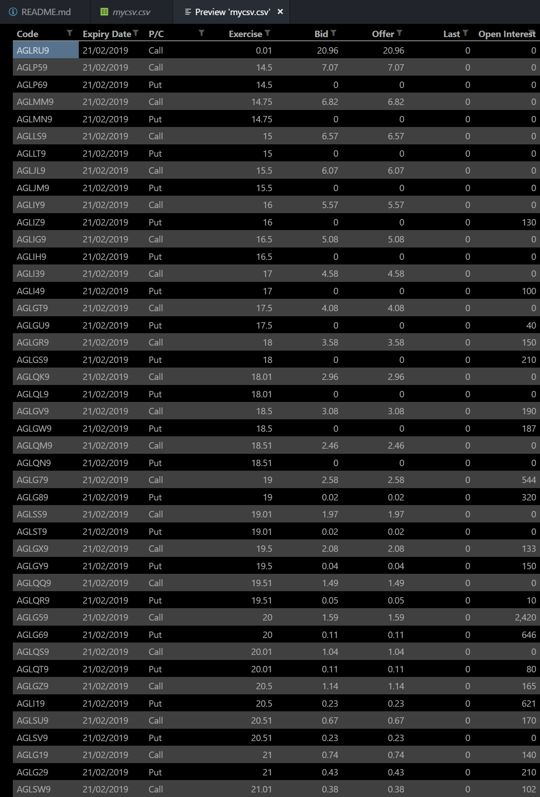

# Web scraper built with python, scrapy and beautifulsoup

## What is ASX Scraper?
This scraper creates a CSV file that contains the publicly available options data for all ASX traded options. Essentially, it generates a snapshot-in-time spreadsheet of all ASX traded options, along with all the relevant information.

## How to use ASX Scraper
1. Clone the repository onto your computer
2. Install Scrapy with `pip install Scrapy`
4. Install bs4 with `pip install beautifulsoup4`
5. `cd` into /asx_options-master and run `python -m scrapy crawl asx_spider`. This will create a .html file in /asx_options-master for every company that has ASX traded options. About 100 .html files will be generated.
6. Run `python parser.py` from /asx_options-master. parser.py will create a new CSV file, parse through the .html files one by one, extract the options data, and place the data into the CSV file. This will take ~20 seconds.
7. Copy-paste the data from the CSV file into a MS Excel spreadsheet.

### Screenshot of the output - showing the the first ~50 of 43,837 lines in the csv file
